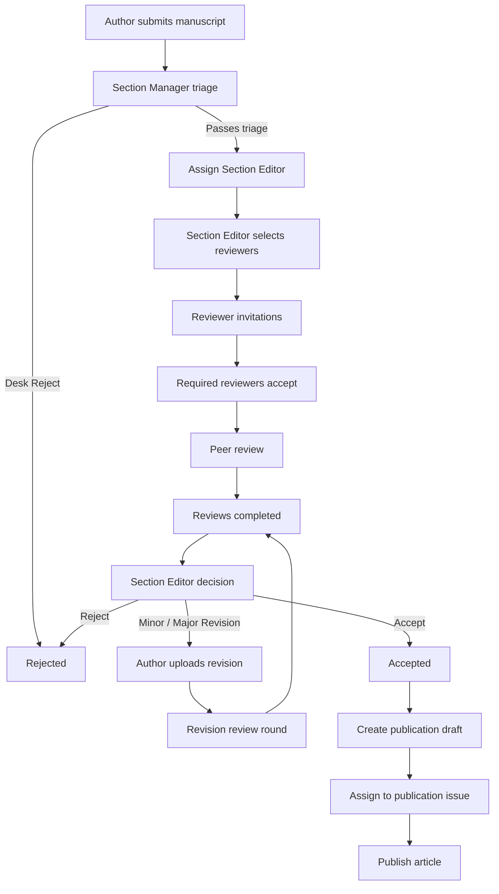
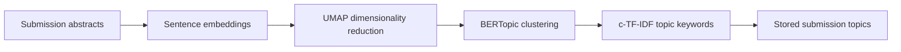
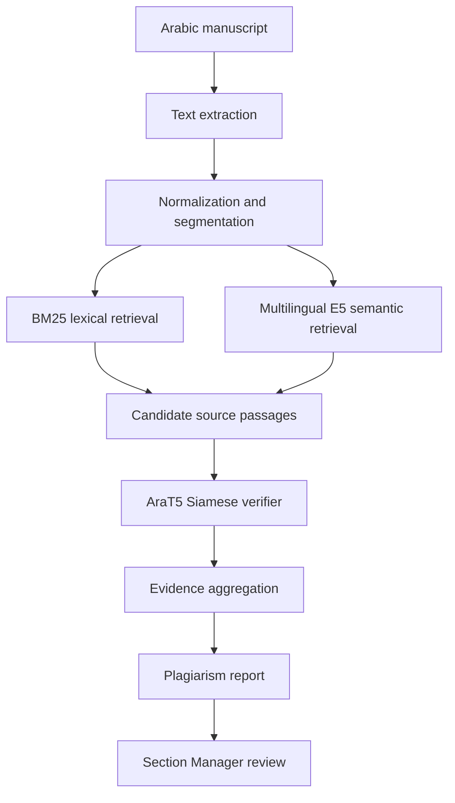
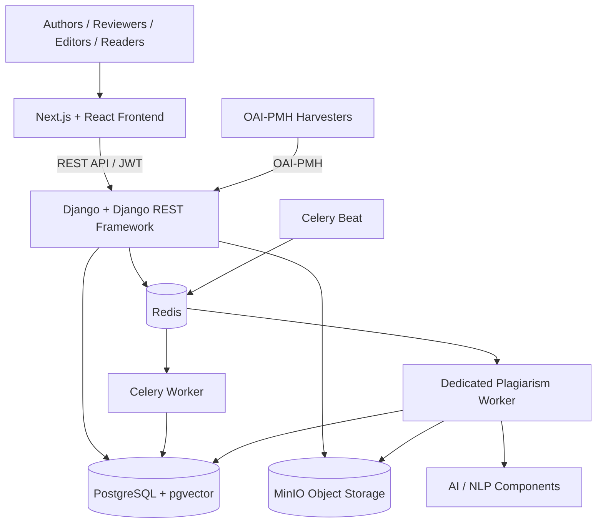

# Intelligent Journal Management System

**Intelligent Journal Management System (IJMS)** is an open-source electronic platform for managing peer-reviewed scientific journals, enhanced with artificial intelligence and scientific text analysis to support editorial decision-making.

The system supports the complete scientific publishing lifecycle:

**Submission → Editorial Screening → Peer Review → Revision → Decision → Publishing → Archiving**

IJMS was developed as a bachelor's graduation project in **Software Engineering and Artificial Intelligence**, using the **University of Aleppo Journal** as a case study.

The project combines a complete journal-management workflow with intelligent features including reviewer recommendation, topic modeling, manuscript prioritization, analytical dashboards, and an Arabic plagiarism-detection pipeline.

> AI features in IJMS are designed as **decision-support tools**. They assist editors but never automatically accept, reject, or accuse a manuscript of plagiarism.

---

## Table of Contents

- [Overview](#overview)
- [Key Features](#key-features)
- [System Roles](#system-roles)
- [Editorial Workflow](#editorial-workflow)
- [Intelligent Features](#intelligent-features)
  - [Reviewer Recommendation](#reviewer-recommendation)
  - [Topic Modeling](#topic-modeling)
  - [Manuscript Prioritization](#manuscript-prioritization)
  - [Arabic Plagiarism Screening](#arabic-plagiarism-screening)
- [Publishing and Discovery](#publishing-and-discovery)
- [Journal Customization](#journal-customization)
- [Notifications](#notifications)
- [System Architecture](#system-architecture)
- [Technology Stack](#technology-stack)
- [Repository Structure](#repository-structure)
- [Getting Started](#getting-started)
- [Plagiarism Pipeline Configuration](#plagiarism-pipeline-configuration)
- [API Documentation](#api-documentation)
- [Testing](#testing)
- [Security and Research Ethics](#security-and-research-ethics)
- [Current Limitations](#current-limitations)
- [Project Context](#project-context)
- [License](#license)

---

# Overview

IJMS provides a reusable foundation for academic institutions that need to manage scientific journals electronically.

Instead of focusing only on manuscript submission, the system models the complete interaction between:

- Authors
- Reviewers
- Section Editors
- Section Managers
- Editors-in-Chief
- Administrators
- Readers

The system manages manuscript versions, editorial assignments, reviewer invitations, multiple review rounds, editorial decisions, publishing, journal issues, notifications, public article discovery, and journal configuration.

AI and NLP components are integrated into the editorial workflow to assist with:

- Reviewer selection
- Manuscript clustering
- Topic extraction
- Editorial workload prioritization
- Research analytics
- Scientific-integrity screening

The project follows a **single-journal-per-deployment** model. Each installation can be customized for a different journal or academic institution without modifying the core workflow implementation.

---

# Key Features

| Area | Status |
|---|---|
| Authentication and role-based access control | ✅ Implemented |
| Electronic manuscript submission | ✅ Implemented |
| Submission metadata and co-authors | ✅ Implemented |
| Private manuscript storage | ✅ Implemented |
| Submission versioning | ✅ Implemented |
| Section Manager triage | ✅ Implemented |
| Desk rejection | ✅ Implemented |
| Section Editor assignment | ✅ Implemented |
| Reviewer applications | ✅ Implemented |
| Reviewer invitation workflow | ✅ Implemented |
| Double-blind peer review | ✅ Implemented |
| Reviewer deadlines | ✅ Implemented |
| Multiple review rounds | ✅ Implemented |
| Editorial decisions | ✅ Implemented |
| Reviewer recommendation | ✅ Implemented |
| Topic modeling and clustering | ✅ Implemented |
| Manuscript prioritization | ✅ Implemented |
| Editorial analytics | ✅ Implemented |
| Arabic plagiarism screening | ✅ Implemented |
| Publication draft creation | ✅ Implemented |
| Issue management | ✅ Implemented |
| Continuous publication workflow | ✅ Implemented |
| Public article portal | ✅ Implemented |
| Metadata exports | ✅ Implemented |
| OAI-PMH provider | ✅ Implemented |
| Email notifications | ✅ Implemented |
| Journal identity customization | ✅ Implemented |
| Configurable public journal pages | ✅ Implemented |
| Scanned-PDF plagiarism OCR | ❌ Not currently supported |
| Multi-journal tenancy | ❌ Outside current scope |

---

# System Roles

IJMS uses role-based access control to separate responsibilities across the scientific-publishing workflow.

A single user may have multiple roles where appropriate.

## Author

Authors can:

- Register and manage their profile.
- Submit manuscripts.
- Enter manuscript metadata.
- Add co-authors.
- Upload full and anonymized manuscript files.
- Track manuscript status.
- Read editorial decision letters.
- View anonymized reviewer feedback.
- Upload revised manuscript versions.
- Submit responses to reviewers.
- Apply to become reviewers.

---

## Reviewer

Approved reviewers can:

- Receive review invitations.
- Accept or decline initial invitations.
- Access assigned blinded manuscripts.
- Submit structured review reports.
- Provide recommendations such as:
  - Accept
  - Minor Revision
  - Major Revision
  - Reject
- Write comments for authors.
- Write confidential comments for editors.
- Participate in revision rounds.
- Track review deadlines.

Reviewer identities remain protected from authors under the double-blind review workflow.

---

## Section Editor

A Section Editor is responsible for manuscripts assigned by the Section Manager.

The Section Editor can:

- Access assigned manuscripts.
- Review manuscript information and editorial history.
- Search eligible reviewers.
- View intelligent reviewer recommendations.
- Invite multiple reviewers.
- Monitor reviewer invitations.
- Replace or cancel reviewers when necessary.
- Monitor active review deadlines.
- Read submitted reviews.
- Make editorial decisions.
- Request minor or major revisions.
- Manage subsequent review rounds.
- Accept or reject manuscripts.
- Hand accepted manuscripts to the publishing workflow.

---

## Section Manager

A Section Manager supervises submissions belonging to a specific scientific section.

The Section Manager can:

- Monitor submissions in the managed section.
- Perform initial manuscript triage.
- Complete editorial screening checklists.
- Perform desk rejection when necessary.
- Review plagiarism-screening results.
- Assign and reassign Section Editors.
- Monitor section-level workflow progress.
- Monitor delayed submissions.
- Monitor editorial workload.
- Review reviewer applications for the section.

---

## Editor-in-Chief

The Editor-in-Chief provides journal-wide editorial oversight.

The Editor-in-Chief can:

- Access journal-level analytical information.
- Monitor activity across sections.
- Review reviewer applications across sections.
- Manage publication issues.
- Manage the continuous-publication lifecycle.
- Monitor journal-wide publishing activity.

---

## Administrator

Administrators manage institutional and system configuration, including:

- User accounts.
- Role assignments.
- Journal configuration.
- Scientific sections.
- Section Managers and editorial memberships.
- Journal identity and branding.
- Public journal content.
- Operational configuration through the administration interface.

---

## Reader

Readers use the public journal portal to:

- Browse published articles.
- Search the journal archive.
- Browse sections and issues.
- View article metadata.
- Download published manuscripts where available.
- Export bibliographic metadata.

---

# Editorial Workflow

The core editorial workflow is implemented as a controlled sequence of state transitions.



## 1. Submission

The author submits:

- Manuscript title
- Abstract
- Keywords
- Language
- Co-author information
- Journal section
- Cover letter when applicable
- Full manuscript
- Blinded manuscript

The original submission becomes **version 1**.

Subsequent revisions create new versions instead of replacing the previous manuscript.

---

## 2. Section Manager Triage

New submissions are routed to the responsible Section Manager.

The manager performs initial editorial screening and can either:

- Reject the submission through a desk rejection, or
- Assign a Section Editor to manage the manuscript.

Assignment history is preserved while the submission maintains a current responsible editor.

---

## 3. Reviewer Selection

The assigned Section Editor can manually search eligible reviewers or use the reviewer recommendation system.

The system filters reviewers according to editorial eligibility rules before presenting them to the editor.

Multiple reviewers may be invited simultaneously.

---

## 4. Reviewer Invitations

Reviewers initially receive invitations rather than immediate manuscript access.

An invitation includes:

- Response deadline
- Review deadline
- Manuscript metadata appropriate for the double-blind workflow

Reviewers may accept or decline the initial invitation.

Once the configured number of required reviewers has accepted, remaining pending invitations are automatically expired.

This prevents a review round from accumulating more accepted reviewers than required.

---

## 5. Peer Review

Accepted reviewers receive access to the blinded manuscript.

Each reviewer submits:

- Recommendation
- Comments for the author
- Optional confidential comments for the editor

The submission becomes ready for an editorial decision once the required review conditions are satisfied.

---

## 6. Editorial Decision

The assigned Section Editor evaluates the review reports and can issue:

- **Accept**
- **Reject**
- **Minor Revision**
- **Major Revision**

Decision letters and decision metadata are preserved with the corresponding manuscript version.

---

## 7. Revision Rounds

When revision is requested:

1. The author receives the decision and reviewer feedback.
2. The author uploads a new manuscript version.
3. The author may provide a response to reviewers.
4. Reviewers from the previous round are carried into the revision workflow according to editorial rules.
5. New reviews are submitted for the revised version.
6. The Section Editor makes another decision.

The previous manuscript versions, reviews, and decisions remain preserved.

---

## 8. Acceptance and Publishing

Once accepted, the manuscript can enter the publishing domain.

The system creates a publication draft based on the accepted manuscript version.

The publication workflow then manages article metadata and issue assignment before the article is made publicly available.

---

# Reviewer Applications

Registered authors can apply to become reviewers.

An application includes:

- Requested scientific section
- Expertise description
- Research keywords
- Reviewer profile information

Applications may be reviewed by:

- The responsible Section Manager
- The Editor-in-Chief
- Administrators

Possible application states are:

```text
PENDING
APPROVED
REJECTED
```

When approved, the system:

- Adds the Reviewer role to the user.
- Preserves the existing Author role.
- Creates or updates the reviewer profile.
- Associates the reviewer with the approved section.
- Stores reviewer expertise.
- Prepares reviewer information for intelligent recommendation.

This allows researchers to switch between their Author and Reviewer workspaces without using separate accounts.

---

# Intelligent Features

The intelligent components of IJMS are designed to support editorial decisions while keeping final authority with human editors.

---

## Reviewer Recommendation

IJMS includes an intelligent reviewer recommendation system for Section Editors.

The process has two main stages:

### 1. Eligibility Filtering

Before computing recommendation scores, the system removes reviewers who should not be considered.

Examples include:

- Inactive users.
- Users without Reviewer authorization.
- Reviewers outside the manuscript's section.
- The manuscript author.
- Co-authors or identity conflicts.
- Reviewers previously invited in the current round.
- Reviewers already active on the same manuscript.
- Reviewers who reached the configured workload limit.

This ensures that expertise similarity is only calculated for reviewers who can actually be assigned.

### 2. Expertise Matching

Eligible reviewers are ranked using signals derived from:

- The manuscript abstract.
- Reviewer expertise descriptions.
- Manuscript keywords.
- Reviewer expertise keywords.

Semantic similarity measures how closely the research content of the manuscript corresponds to the reviewer's expertise.

Keyword coverage provides an additional interpretable signal.

The result is a ranked list of reviewer suggestions.

> Reviewer recommendation never automatically assigns a reviewer. The Section Editor remains responsible for the final selection.

---

## Topic Modeling

IJMS uses topic modeling to discover thematic groups within submissions belonging to a scientific section.

The pipeline operates primarily on manuscript abstracts.



The implementation uses:

- Sentence-transformer embeddings
- UMAP
- BERTopic
- c-TF-IDF representative keywords

A submission can also be marked as an outlier when BERTopic cannot assign it to a meaningful cluster.

Topic information supports:

- Editorial analytics
- Research-trend analysis
- Submission grouping
- Reviewer recommendation context
- Section-level topic dashboards

---

## Manuscript Prioritization

Editorial queues can contain many active manuscripts at different workflow stages.

IJMS therefore provides a transparent manuscript-prioritization mechanism to help editors identify submissions requiring attention.

The prioritization logic uses interpretable workflow indicators rather than a black-box acceptance model.

Factors may include:

- Time spent waiting.
- Urgency of the current workflow state.
- Reviewer shortages.
- Overdue reviewer invitations.
- Overdue reviews.
- Number of completed revision rounds.

The resulting priority is intended for **queue organization only**.

It has no authority over scientific acceptance or rejection.

---

## Arabic Plagiarism Screening

IJMS includes an Arabic plagiarism-detection pipeline developed as part of the project.

The system is designed for **initial scientific-integrity screening**, not for issuing automatic plagiarism accusations.

The integrated pipeline follows a multi-stage retrieval and verification architecture:



### Pipeline Components

The plagiarism subsystem includes:

- Arabic text preprocessing.
- Offset-preserving manuscript segmentation.
- BM25 lexical candidate retrieval.
- Multilingual-E5 semantic embeddings.
- Semantic candidate retrieval.
- Hybrid lexical/semantic retrieval.
- A trained AraT5 Siamese passage-pair verifier.
- Evidence aggregation.
- Passage-level evidence.
- Human-review reporting.

### Asynchronous Execution

Plagiarism analysis can be computationally expensive.

It therefore runs through a dedicated Celery queue and worker:

```text
plagiarism queue
        ↓
dedicated plagiarism worker
        ↓
pipeline resources
        ↓
stored screening report
```

This isolates expensive model inference from the normal application worker.

### Editorial Integration

For supported submissions, a screening can be created after manuscript submission.

The screening lifecycle supports states such as:

```text
QUEUED
RUNNING
COMPLETED
FAILED
```

The responsible Section Manager can inspect the completed report.

The report contains:

- Summary statistics.
- Detected evidence passages.
- Source passages.
- Source information.
- Character offsets.
- Verification scores.
- Human-review indicators.

Reports use the versioned:

```text
plagiarism_report_v1
```

schema.

### Scientific-Integrity Safeguards

Plagiarism screening:

- Does **not** automatically reject a manuscript.
- Does **not** modify the manuscript workflow status.
- Does **not** describe similarity as proven misconduct.
- Does **not** treat zero detected matches as proof of originality.
- Requires human editorial interpretation.

### Current Plagiarism Scope

The current integration supports:

- Arabic manuscripts.
- Text-based PDF files.

The current implementation does **not** perform OCR for scanned PDFs.

Models, semantic indexes, trained checkpoints, and comparison-corpus data are deployment-specific resources and are intentionally not stored in the Git repository.

For detailed configuration, see:

```text
docs/plagiarism-screening.md
```

---

# Publishing and Discovery

Accepted manuscripts enter a dedicated publication workflow.

## Publication Drafts

An accepted submission can be converted into a publication draft.

The publication record maintains a relationship with the accepted manuscript version so the publishing workflow remains traceable to the editorial process.

---

## Issue Management

The system supports journal issues and continuous publication.

The Editor-in-Chief can manage the current publication issue and control transitions between active and archived issues.

Published articles are associated with journal issues and publication metadata.

---

## Public Journal Portal

The public-facing journal interface supports:

- Published article browsing.
- Article search.
- Filtering.
- Pagination.
- Scientific section browsing.
- Issue browsing.
- Journal archives.
- Article detail pages.
- PDF downloads.
- Related content.
- Publication metadata.

---

## Metadata Export

Published article metadata can be exported using common scholarly formats including:

- BibTeX
- RIS
- Dublin Core

---

## OAI-PMH

IJMS exposes an **OAI-PMH provider** for scholarly metadata harvesting.

The provider is available through:

```text
/oai
```

and supports standard OAI-PMH operations for academic discovery systems.

This enables interoperability with:

- Institutional repositories.
- Academic harvesters.
- Library discovery services.
- Scholarly search infrastructure.

---

# Journal Customization

IJMS is designed to be reusable by different institutions.

The system follows a **single-journal-per-deployment** architecture while allowing journal-specific configuration to remain separate from core business logic.

Administrators can configure journal identity and public information without changing application source code.

## Journal Identity

Configurable information includes:

- Journal title
- Short name
- Description
- Publisher
- Journal logo
- Primary brand color
- Print ISSN
- Online ISSN
- Default language
- Publication license
- Access policy
- Peer-review policy
- Publication frequency
- OAI-PMH metadata

---

## Public Journal Content

The system supports configurable journal information pages including:

- About the Journal
- Author Guidelines
- Publication Ethics
- Open Access
- Editorial Board
- Contact

Published content is available through the public portal, while draft content remains private.

---

## Scientific Sections

Administrators can manage:

- Scientific sections
- Section activation
- Section Managers
- Section Editors
- Editorial memberships

Workflow role semantics themselves remain controlled by application logic so institutional customization cannot silently bypass security rules.

Detailed configuration instructions are available in:

```text
docs/customization.md
```

---

# Notifications

IJMS includes asynchronous email notifications for important editorial events.

Supported notifications include:

- Reviewer invitation
- Section Editor assignment
- Editorial decision
- Desk rejection
- Revision-related events
- Upcoming review deadline
- Article publication

Notifications are dispatched through Celery after relevant database transactions successfully commit.

This prevents email failures from rolling back editorial operations.

Scheduled review reminders are handled through **Celery Beat**.

Notification messages are designed to respect double-blind confidentiality and avoid exposing sensitive manuscript or review information through email.

---

# System Architecture

IJMS follows a **modular monolith** architecture.

The application is deployed as one main backend system while separating business domains into independent Django applications.



## Architectural Principles

The project follows several software-engineering principles:

- Modular domain separation.
- REST-based client/server communication.
- Layered backend design.
- Service-layer business logic.
- Centralized workflow transitions.
- Role-based authorization.
- Asynchronous processing for expensive tasks.
- Separation of configuration from application logic.
- Private object storage for manuscripts.
- Preservation of workflow history.
- Human oversight for AI-assisted decisions.

---

# Technology Stack

## Backend

- **Python**
- **Django 5**
- **Django REST Framework**
- **Simple JWT**
- **drf-spectacular**
- **Celery**
- **django-celery-beat**
- **Redis**

---

## Database

- **PostgreSQL**
- **pgvector**

PostgreSQL stores both traditional journal-management data and vector representations used by intelligent features.

---

## Frontend

- **Next.js 16**
- **React 19**
- **TypeScript**
- **TanStack Query**
- **Axios**
- **React Hook Form**
- **Zod**
- **Tailwind CSS**
- **shadcn**
- **Lucide React**

---

## File Storage

- **MinIO**

Private manuscript files are stored separately from the application database.

---

## AI and NLP

- **Sentence Transformers**
- **BERTopic**
- **UMAP**
- **scikit-learn**
- **PyTorch**
- **Hugging Face Transformers**
- **multilingual-E5**
- **AraT5**

---

## Development and Deployment

- **Docker**
- **Docker Compose**
- **Git**
- **GitHub**

---

# Backend Domains

The Django backend is divided into domain-oriented applications.

| Application | Responsibility |
|---|---|
| `accounts` | Users, roles, reviewer profiles and reviewer applications |
| `journals` | Journal configuration, scientific sections and issues |
| `submissions` | Manuscripts, metadata, co-authors, versions and topics |
| `workflow` | Editorial assignments and workflow state |
| `reviews` | Reviewer management, invitations and reviews |
| `integrity` | Plagiarism-screening integration |
| `publishing` | Publication drafts and published articles |
| `discovery` | OAI-PMH scholarly metadata provider |
| `notifications` | Asynchronous editorial notifications |

Complex workflow operations are implemented through services rather than placing business logic directly inside API views.

---

# Repository Structure

A simplified repository structure is:

```text
Intelligent-Journal-Management-System/
│
├── backend/
│   │
│   ├── apps/
│   │   ├── accounts/
│   │   ├── discovery/
│   │   ├── integrity/
│   │   ├── journals/
│   │   ├── notifications/
│   │   ├── publishing/
│   │   ├── reviews/
│   │   ├── submissions/
│   │   └── workflow/
│   │
│   ├── config/
│   ├── plagiarism_core/
│   ├── manage.py
│   ├── Dockerfile
│   └── requirements.txt
│
├── frontend/
│   ├── app/
│   ├── components/
│   ├── features/
│   ├── lib/
│   └── package.json
│
├── docs/
│
├── pipeline_resources/
│   └── ...
│
├── .env.example
├── docker-compose.yml
└── README.md
```

`pipeline_resources/` is deployment-specific and is not intended to contain trained models or datasets tracked through Git.

---

# Getting Started

## Prerequisites

Recommended development environment:

- Docker
- Docker Compose
- Git
- Node.js 20+ if running the frontend outside Docker
- npm

The plagiarism subsystem additionally requires external model and index resources if enabled.

---

## 1. Clone the Repository

```bash
git clone https://github.com/Christina1207/Intelligent-Journal-Management-System.git
cd Intelligent-Journal-Management-System
```

---

## 2. Create the Environment File

Copy the example configuration:

### Linux / macOS

```bash
cp .env.example .env
```

### Windows PowerShell

```powershell
Copy-Item .env.example .env
```

Update sensitive values before starting the system.

Important configuration areas include:

```text
Django
PostgreSQL
Redis
Celery
MinIO
Email
Frontend URL
Embedding configuration
Plagiarism pipeline configuration
```

Never commit the real `.env` file.

---

## 3. Start Backend Infrastructure

The project uses Docker Compose for the backend infrastructure.

```bash
docker compose up --build
```

Core services include:

- PostgreSQL
- Redis
- MinIO
- Database migrations
- Django backend
- Celery worker
- Celery Beat
- Dedicated plagiarism worker

The Django API is normally available at:

```text
http://localhost:8000
```

---

## 4. Start the Frontend

If the frontend is being run outside Docker:

```bash
cd frontend
npm install
npm run dev
```

The frontend is normally available at:

```text
http://localhost:3000
```

For a production frontend build:

```bash
npm run build
npm run start
```

---

## 5. Stop the Environment

```bash
docker compose down
```

To also remove named development volumes:

```bash
docker compose down -v
```

> Removing volumes deletes locally persisted PostgreSQL, Redis, MinIO, and other volume data. Use this command carefully.

---

# Environment Configuration

The repository contains:

```text
.env.example
```

with the main configuration variables required by the application.

Important variables include:

```env
SECRET_KEY=
DEBUG=
ALLOWED_HOSTS=

POSTGRES_DB=
POSTGRES_USER=
POSTGRES_PASSWORD=
POSTGRES_HOST=
POSTGRES_PORT=

CELERY_BROKER_URL=
CELERY_RESULT_BACKEND=

MINIO_ENDPOINT=
MINIO_PUBLIC_ENDPOINT=
MINIO_ACCESS_KEY=
MINIO_SECRET_KEY=
MINIO_BUCKET_NAME=

FRONTEND_URL=

EMAIL_BACKEND=
EMAIL_HOST=
EMAIL_PORT=
EMAIL_HOST_USER=
EMAIL_HOST_PASSWORD=

EMBEDDING_MODEL_NAME=
EMBEDDING_DIMENSIONS=
```

Do not use example passwords or development secrets in a real deployment.

---

# Plagiarism Pipeline Configuration

The plagiarism pipeline is **disabled by default** because its resources are deployment-specific.

Enable it only after the required resources are configured.

```env
PLAGIARISM_ENABLED=True
```

The deployment must provide resources such as:

```text
multilingual-E5 model
AraT5 base model
trained verifier checkpoint
indexed source corpus
semantic embedding cache
BM25 cache
```

Typical configuration includes:

```env
PLAGIARISM_RESOURCE_ROOT=
PLAGIARISM_CACHE_ROOT=
PLAGIARISM_DATABASE_URL=
PLAGIARISM_SOURCE_TYPE=

PLAGIARISM_E5_MODEL_DIRECTORY=
PLAGIARISM_ARAT5_MODEL_DIRECTORY=
PLAGIARISM_CHECKPOINT_PATH=
PLAGIARISM_SEMANTIC_CACHE_DIRECTORY=
PLAGIARISM_BM25_CACHE_DIRECTORY=
```

Models, datasets, source corpora, generated indexes, reports, and secrets should **not** be committed to Git.

See:

```text
docs/plagiarism-screening.md
```

for detailed deployment and verification instructions.

---

# API Documentation

The backend exposes a versioned REST API under:

```text
/api/v1/
```

Interactive OpenAPI documentation is generated using **drf-spectacular**.

## Swagger UI

```text
http://localhost:8000/api/v1/docs/
```

## ReDoc

```text
http://localhost:8000/api/v1/redoc/
```

## OpenAPI Schema

```text
http://localhost:8000/api/v1/schema/
```

Authentication uses JWT bearer tokens.

Example:

```http
Authorization: Bearer <access-token>
```

---

# OAI-PMH

The scholarly discovery provider is available at:

```text
http://localhost:8000/oai
```

or:

```text
http://localhost:8000/oai/
```

It exposes journal publication metadata to compatible scholarly harvesting systems.

---

# Testing

## Backend

Run Django system checks:

```bash
python manage.py check
```

or inside the running backend container:

```bash
docker compose exec backend python manage.py check
```

Check for missing migrations:

```bash
python manage.py makemigrations --check --dry-run
```

Run backend tests:

```bash
python manage.py test
```

or:

```bash
docker compose exec backend python manage.py test
```

Individual applications can also be tested independently:

```bash
python manage.py test apps.submissions
python manage.py test apps.workflow
python manage.py test apps.reviews
python manage.py test apps.publishing
python manage.py test apps.integrity
python manage.py test apps.notifications
```

---

## Frontend

```bash
cd frontend
npm run lint
npm run build
```

The project includes validation of major workflows such as:

- Submission creation
- Editorial triage
- Section Editor assignment
- Reviewer invitations
- Peer review
- Revision rounds
- Editorial decisions
- Publishing handoff
- Role permissions
- Double-blind confidentiality
- Plagiarism-screening access controls
- Notifications

---

# Security and Research Ethics

Scientific manuscripts and peer reviews contain sensitive and potentially unpublished information.

IJMS therefore treats security and research ethics as core system requirements.

Important safeguards include:

- JWT-based authentication.
- Role-based authorization.
- Section-scoped editorial permissions.
- Private manuscript storage.
- Double-blind reviewer protection.
- Restricted access to confidential review information.
- Restricted plagiarism evidence access.
- No manuscript attachments in notification emails.
- Environment-based secret management.
- Workflow-history preservation.
- Human oversight for AI recommendations.

---

## AI Ethics

AI outputs are never treated as final scientific judgments.

### Reviewer Recommendation

The recommendation system suggests candidates but cannot assign them automatically.

### Manuscript Prioritization

Priority scores organize editorial queues but do not influence scientific acceptance.

### Topic Modeling

Topics are analytical representations and are not scientific classifications enforced by the workflow.

### Plagiarism Detection

Similarity evidence indicates possible overlap requiring editorial review.

A detection is **not proof of plagiarism**, and absence of detected evidence is **not proof of originality**.

---

# Current Limitations

The current project has several intentional scope limitations.

## Single-Journal Deployment

Each installation represents one journal.

The project does not currently implement multi-tenant hosting of multiple independent journals from one deployment.

---

## Plagiarism Language Scope

The integrated plagiarism pipeline currently targets Arabic manuscripts.

---

## Scanned PDFs

The plagiarism pipeline expects text-based PDF documents.

OCR for scanned manuscript images is not currently included.

---

## External AI Resources

Large models, trained checkpoints, source corpora, and generated semantic indexes are not distributed through Git.

A deployment enabling plagiarism analysis must provide those resources separately.

---

## Human Editorial Authority

The intelligent components are deliberately not permitted to make final editorial decisions.

Acceptance, rejection, reviewer assignment, and scientific-integrity decisions remain under human editorial control.

---

# Design Principles

The development of IJMS follows the following principles:

1. **Human-centered AI**

   Intelligent features provide evidence and recommendations rather than automatic editorial judgments.

2. **Clear domain boundaries**

   Accounts, submissions, reviews, workflow, publishing, integrity, and discovery are represented by separate backend modules.

3. **Centralized business rules**

   Complex workflow operations are handled through services and centralized transition rules.

4. **Historical traceability**

   Manuscript versions, assignments, reviews, and decisions are preserved.

5. **Configuration over hardcoding**

   Journal identity and institutional content remain configurable.

6. **Asynchronous expensive work**

   Notifications, clustering, reminders, and plagiarism processing can run outside synchronous HTTP requests.

7. **Privacy by design**

   Double-blind identities, confidential comments, private manuscripts, and integrity reports are protected by authorization rules.

8. **Explainable decision support**

   Where possible, AI results expose scores, evidence, keywords, or contributing workflow indicators.

---

# Project Context

This project was developed as a bachelor's graduation project in **Software Engineering and Artificial Intelligence**.

Its objective is to analyze and develop an open-source electronic system for managing peer-reviewed scientific journals while enhancing the system with AI and scientific-text-analysis techniques.

The project focuses on building a reusable and customizable platform covering the complete academic-publishing lifecycle:

```text
Submission
    ↓
Editorial Screening
    ↓
Peer Review
    ↓
Evaluation
    ↓
Revision
    ↓
Editorial Decision
    ↓
Publishing
    ↓
Archiving and Discovery
```

The **University of Aleppo Journal** was used as the principal institutional case study.

The intelligent components were developed to improve:

- Scientific-integrity screening.
- Reviewer selection.
- Editorial workload management.
- Research-topic analysis.
- Publishing analytics.
- Data-supported editorial decision-making.

---

# Documentation

Additional project documentation is available under:

```text
docs/
```

Important documents include:

```text
docs/plagiarism-screening.md
docs/customization.md
```

The REST API is additionally documented through the generated OpenAPI interface.

---

# License

The project is intended for open-source release.

An explicit open-source `LICENSE` file has not yet been included in the repository and should be added before public redistribution or reuse under a defined software license.

---

# Intelligent Journal Management System

**Open-source journal management enhanced with human-centered AI for scientific publishing.**
